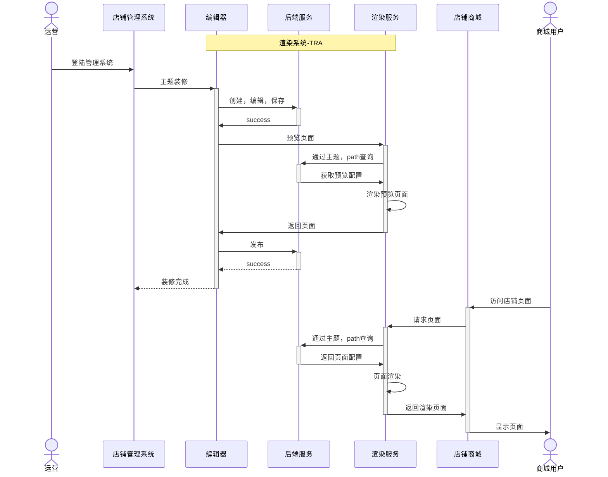

# 写在前面
DSL（Domain-Specific Language，领域特定语言）是指专门用于特定应用领域的编程语言，例如 SQL、HTML、CSS 和正则（Regex）等。本文将介绍一些在编写产出方案文档时常用的 DSL 技巧，如制作流程图、时序图和表关联关系等。
##  <a href='https://mermaid.js.org/intro/'>Mermaid</a>
> 在此之前，我使用`draw.io`来制作流程图、表关系图等，但是他有一个缺陷，如果需要修改其中的内容，就要在app或网页修改后重新导出，操作起来比较繁琐。

以下是我某次实例，我在下面贴了源码实现，他用了DSL方式输出时序图，国产的文档app如钉钉文档，飞书或者md解析器都支持`mermaid`，改起来也相当方便。以下只是sequenceDiagram（时序图）的示例，他还支持很多其他类型的图，如流程图、柱状图、类图、状态图㩐等。

<pre>

</pre>


## <a href='https://dbdiagram.io/d'>DBML</a>
 DBML 语法类似 DDL 。因为不同 SQL 的 DDL 都不相同，所以它的语法还是和 DDL 有一些区别。 在此之前，我通常是通过这几种方式来输出表关系图:

  - 使用数据库工具如 `Navicat` ，使用 DDL 生成。（ Navivat 在 linux 平台功能阉割， pass）
  - 使用 GolangOrm `entgo`把表开发好，框架内部集成了生成表关系图的功能。（之前 Go 开发的时候使用过，比较美观，但是引入额外的开发工作）
  - `draw.io` 如上所示，它修改起来比较麻烦，样式需要自定义调整才会美观。

<br>

综上，每种方式都有痛点，我就再找有没有在线 DDL 转为表关系图的网站，找了几个 DDL 直接转图的网站，转出来多少会有点问题，因为存在不同 SQL ，不同 DDL 标准的问题。 最后使用这个这种的方案使用 DBML 来进行生成表关系图, 而且它的样式还是比较美观的，示例如下

```
Table follows {
  following_user_id integer
  followed_user_id integer
  created_at timestamp 
}

Table users {
  id integer [primary key]
  username varchar
  role varchar
  created_at timestamp
}

Table posts {
  id integer [primary key]
  title varchar
  body text [note: 'Content of the post']
  user_id integer
  status varchar
  created_at timestamp
}

Ref: posts.user_id > users.id // many-to-one
Ref: users.id < follows.following_user_id
Ref: users.id < follows.followed_user_id
```


